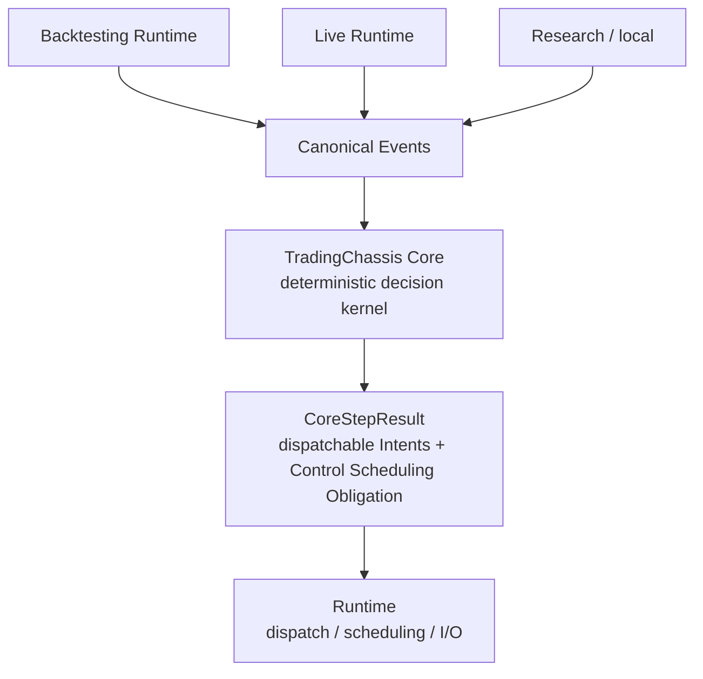

# TradingChassis Core

`tradingchassis_core` is the stable deterministic trading decision kernel
for TradingChassis: an event-step engine that applies ordered canonical Events
(the Event Stream under Processing Order and Configuration)
and produces `CoreStepResult` outputs—including Strategy-generated and
candidate Intents, optional `dispatchable_intents`, and optional
Control Scheduling Obligation output. It does not perform Venue I/O,
Execution (adapter-side dispatch), or Runtime orchestration.

**What it is:** a shared library for the decision path only—canonical Event in,
deterministic Strategy / Risk Engine / Execution Control processing, Intents and
Execution Control outputs out.

**What it is not:** a one-off Backtesting script, a Venue
connector, a Live or Kubernetes Runtime, or anything that performs external
dispatch. The same Core is meant to stay stable while local Research, Backtesting,
simulation, Live trading, Venue Adapters, and infrastructure around you change.

> Terminology: Definitions and related terms match the
> [`canonical terminology`](https://tradingchassis.github.io/docs/latest/00-guides/terminology/).
> In-repo pointers: [`core/docs/README.md`](docs/README.md) and
> [`core/docs/code-map/core-pipeline-map.md`](docs/code-map/core-pipeline-map.md).

## Why this is relevant

Trading systems often drift when Backtesting logic, Live logic, policy limits, and
Strategy throttling are implemented in different places. TradingChassis Core
centralizes deterministic decision semantics—State reduction, Strategy
evaluation, Risk Engine (policy) admission, and Execution Control
(planning apply over reconciled Intents)—in one library. Runtime
environments (Backtesting, Live, Research tooling, Kubernetes-backed
deployments, different Venue Adapters) may change; Core should not.

A typical notebook or one-off Backtesting script inlines feed handling, Strategy rules,
Risk Engine (policy) checks, and how orders are sent in one place. That is fast to sketch but
tends to fork: the Live path reimplements similar ideas with different bugs and
timing. Core keeps the decision kernel in one place: Runtimes normalize inputs into
canonical Events, invoke Core, and perform Execution and dispatch outside Core using
`CoreStepResult`; Strategy, Risk Engine,
and Execution Control semantics stay identical across those Runtimes when the
Event Stream and Configuration match.

## What this gives you

| What you get | Why it matters |
| --- | --- |
| One deterministic Core pipeline | Same Event-step path for reduction → evaluation → candidates → Risk Engine → Execution Control apply |
| Canonical Event input model (`EventStreamEntry`) | Aligns with Event Stream + Processing Order; State is `f(Event Stream, Configuration)` |
| Strategy output as Intents | Internal, order/Venue-agnostic commands before Venue Adapter-specific shapes |
| Risk Engine separated from Execution Control | Risk Engine (policy) vs Queue / scheduling / rate-aware presentation split, as in the intent pipeline (Strategy → Risk → Queue → Adapter) |
| `dispatchable_intents` + optional Control Scheduling Obligation | Runtime performs Execution and injects Control-Time Events when obligations are realized |
| Runtime-independent package | Test trading semantics without production I/O; explicit ownership boundary |
| Shared kernel across environments | Serious Backtesting and Live parity for the decision engine—no secondary copy of Strategy/Risk Engine/Execution Control code elsewhere |

In short: one pipeline, canonical Events, Intents inside Core, policy vs Execution
Control split, dispatchable Intents plus optional Control Scheduling Obligation for
the Runtime, and a boundary that makes parity and testing practical—not a second
copy of decision logic per environment.

## Why this matters for trading

The gap between tested behavior and Live trading behavior can dominate outcomes. **Backtesting**
is only a reliable guide if the **same** Core decision logic—Strategy,
Risk Engine, Execution Control—can drive Live when the Event Stream and
Configuration are comparable. Deterministic Core logic driven by canonical Events
makes that logic reproducible and unit-testable without duplicating it in each
Runtime.

This package does **not** guarantee profitable trading, perfect Backtesting/Live
equality, or identical fills. It **does** remove a major class of drift: the
decision engine itself. Wall-clock scheduling, Venue behavior, Venue Adapter
mapping, latency, liquidity, market-data quality, and infrastructure failure modes
stay in the Runtime, Venue Adapter, and Venue—not in Core.

## How it fits into a full system

Backtesting Runtimes, Live Runtimes, and local Research or simulation harnesses can
all feed the **same** Core: they normalize feeds, timestamps, and control semantics
into canonical Events, build `EventStreamEntry` sequences, and call the same
`run_core_step` / reduction APIs. Core always returns the same contract
(`CoreStepResult`) for a given step; each Runtime owns environment-specific
Execution, scheduling glue, and Control-Time Event injection when a Control Scheduling Obligation is realized.



Core never replaces the Runtime: the Runtime is responsible for feeding canonical
Events and for turning `dispatchable_intents` into Venue traffic (and for everything
Kubernetes, credentials, and operations-related). What stays stable is the Core
pipeline and contracts; what varies by design is Runtime choice, Venue Adapter,
Venue, and deployment.

## Backtesting and Live parity

Core is designed to reduce decision-logic drift between Backtesting
and Live: the same canonical Event + `run_core_step` / reduction APIs
can drive both worlds when each Runtime constructs comparable `EventStreamEntry`
sequences under the same Configuration. Normalizing feeds, timestamps, and
control semantics before they enter Core narrows unnecessary divergence.

Core does not remove every simulation-vs-production gap. Individual Venue
behavior, latency, fills and liquidity, market-data quality, Venue Adapter
behavior, Runtime scheduling, and infrastructure failure modes can still
differ and must be modeled outside Core. What Core removes is a major
source of mismatch—duplicating and subtly diverging Strategy/Risk Engine/
Execution Control itself.

## When to use this package

- Building an internal trading system where Backtesting and Live should share decision semantics.
- Wanting a deterministic Strategy / Risk Engine / Execution Control kernel.
- Separating trading semantics from Venue Adapters, I/O, and Kubernetes wiring.
- Testing decisions and Intents without full Backtesting or Live machinery.
- Sharing one decision path across simulation and production.

## When not to use this package

- You only need a one-off Backtesting notebook experiment.
- You want a complete Venue connector or turnkey Live implementation.
- You expect this package to ship a full Kubernetes Runtime, deployment manifests, or production operations.
- You expect Core to execute orders, talk to Venues, replace Venue Adapters, or perform external dispatch.

## Full pipeline

Internal processing pipeline, in sequential order:

```text
Runtime reduces to canonical Events

  -> process_event_entry / process_canonical_event
  -> Strategy evaluation
  -> generated Intents
  -> candidate records
  -> dominance / reconciliation
  -> Risk Engine (policy)
  -> Execution Control plan/apply
  -> CoreStepResult.dispatchable_intents

Runtime dispatches Intents into Orders
```

## Input / Core / Output / Not Owned By Core

- Input: `EventStreamEntry` values with canonical Events and Event Stream position.
- Core does: deterministic reduction, Strategy evaluation boundary, candidate
  merge/dominance, Risk Engine (policy), Execution Control planning/apply.
- Output: `CoreStepResult` with generated/candidate Intents, optional
  `dispatchable_intents`, and optional `control_scheduling_obligation`.
- Not owned by Core: raw market/feed I/O, Venue Adapters, external dispatch,
  credentials/environment wiring, Runtime orchestration, Kubernetes/deployment.

## Quickstart

Run the quickstart

```bash
python examples/core_step_quickstart.py
```

or minimal shape:

```python
import tradingchassis_core as tc

state = tc.StrategyState(event_bus=tc.NullEventBus())
result = tc.run_core_step(
    state,
    tc.EventStreamEntry(
        position=tc.ProcessingPosition(index=0),
        event=tc.ControlTimeEvent(
            ts_ns_local_control=1_000,
            reason="scheduled_control_recheck",
            due_ts_ns_local=1_000,
            realized_ts_ns_local=1_000,
            obligation_reason="rate_limit",
            obligation_due_ts_ns_local=1_000,
            runtime_correlation=None,
        ),
    ),
)
print(result.generated_intents, result.dispatchable_intents)
# Expected: () () — no Strategy or Risk Engine/Execution Control path in this snippet.
```

See `examples/core_step_quickstart.py` for a full runnable walkthrough.

## Public Entrypoints

| Entrypoint | Purpose |
| --- | --- |
| `run_core_step` | One-entry deterministic reduce/evaluate/decide/apply step |
| `run_core_wakeup_reduction` | Multi-entry reduction phase for one wakeup |
| `run_core_wakeup_decision` | Wakeup-level candidate/Risk Engine/Execution Control decision phase |
| `run_core_wakeup_step` | Convenience wrapper for reduction + decision |
| `process_event_entry` | Reduce one `EventStreamEntry` into `StrategyState` |
| `process_canonical_event` | Reduce one canonical Event into `StrategyState` |

## Ownership Boundary

| Core owns | Runtime owns |
| --- | --- |
| canonical models/contracts | raw I/O and feed adapters |
| State reduction and ordering | Venue Adapters and transport |
| Strategy evaluation boundary | adapter-side Execution |
| candidate Intents and reconciliation | credentials/env wiring |
| Risk Engine (policy) | Backtesting/Live orchestration |
| Execution Control | Kubernetes/deployment |
| `CoreStepResult` decision contract | Runtime lifecycle glue |

## Developer Commands

From root:

```bash
python -m pip install -e ".[dev]"
python examples/core_step_quickstart.py
./scripts/check.sh
python -m build
```
