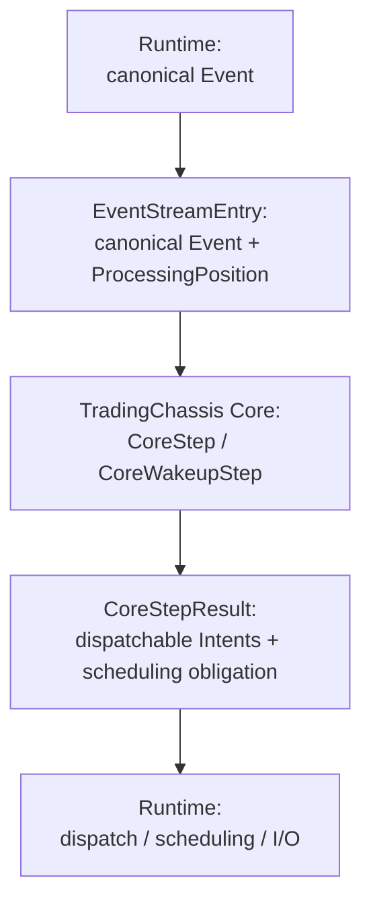

# TradingChassis Core

`tradingchassis_core` is the stable deterministic trading decision kernel
for TradingChassis: an event-step engine that applies ordered canonical Events
(the Event Stream under Processing Order and Configuration)
and produces `CoreStepResult` outputs—including strategy-generated and
candidate Intents, optional `dispatchable_intents`, and optional
Control Scheduling Obligations. It does not perform Venue I/O,
Execution (adapter-side dispatch), or Runtime orchestration.

> Terminology: Definitions for Core, Runtime, Event Stream,
> Processing Order, Intent, Risk Engine, Execution Control,
> Queue, Backtesting, Live, and related terms match the [canonical
> terminology](https://tradingchassis.github.io/docs/latest/00-guides/terminology/).

## Why this exists

Trading systems often drift when Backtesting logic, Live logic, policy limits, and
Strategy throttling are implemented in different places. TradingChassis Core
centralizes deterministic decision semantics—state reduction, Strategy
evaluation, Risk Engine (policy) admission, and Execution Control
(planning apply over reconciled Intents)—in one library. Runtime
environments (Backtesting, Live, research tooling, Kubernetes-backed
deployments, different Venue Adapters) may change; Core should not.

## What this gives you

| What you get | Why it matters |
| --- | --- |
| One deterministic Core pipeline | Same event-step path for reduction → evaluation → candidates → policy → execution-control apply |
| Canonical Event input model (`EventStreamEntry`) | Aligns with Event Stream + Processing Order; State is `f(Event Stream, Configuration)` |
| Strategy output as Intents | Internal, order/venue-agnostic commands before adapter-specific shapes |
| Risk Engine separated from Execution Control | Policy admission vs Queue / scheduling / rate-aware presentation split, as in the intent pipeline (Strategy → Risk → Queue → Adapter) |
| `dispatchable_intents` + optional Control Scheduling Obligation | Runtime performs Execution and injects Control-Time Events when obligations are realized |
| Runtime-independent package | Test trading semantics without production I/O; explicit ownership boundary |
| Shared kernel across environments | Serious Backtesting-Live parity for the decision engine—no secondary copy of Strategy/Risk Engine/Execution-Control code elsewhere |

## Why this matters for trading

The gap between tested behavior and real behavior can dominate outcomes.
Backtesting is useful when the same Core semantics—given comparable
Event Stream and Configuration—drive decisions in simulation and
production. Deterministic, canonical-event-driven Core logic makes Strategy,
policy, and Execution Control behavior reproducible and unit-testable.
Wall-clock scheduling, Venue behavior, adapter mapping, and infrastructure
stay in the Runtime and Venue Adapter, not in Core.

## How it fits into a full system

Runtimes normalize inputs into canonical Events and feed the Core.
The Core always returns the same result type (`CoreStepResult`) for a given step;
each Runtime handles environment-specific Execution, scheduling glue, and Control-Time Event
injection when a Control Scheduling Obligation is realized.



## Backtesting-Live parity

Core is designed to reduce decision-logic drift between Backtesting
and Live: the same canonical Event + `run_core_step` / reduction APIs
can drive both worlds when Runtimes construct comparable `EventStreamEntry`
sequences under the same Configuration. Normalizing feeds, timestamps, and
control semantics before they enter Core narrows unnecessary divergence.

Core does not remove every simulation-vs-production gap. Individual Venue
behavior, latency, fills and liquidity, market-data quality, Venue Adapter
behavior, Runtime scheduling, and infrastructure failure modes can still
differ and must be modeled outside Core. What Core removes is a major
source of mismatch—duplicating and subtly diverging Strategy/Risk Engine/
Execution Control itself.

## When to use this package

- Building an internal trading system where Backtesting and Live should share decision semantics.
- Wanting a deterministic Strategy / Risk Engine / Execution Control kernel.
- Separating trading semantics from adapters, I/O, and Kubernetes wiring.
- Testing decisions and Intents without Runtime harnesses.
- Sharing one decision path across simulation and production.

## When not to use this package

- You only need a one-off notebook Backtesting experiment.
- You want a complete Venue connector or turnkey Live implementation.
- You expect this to ship a full Kubernetes Runtime, deployment manifests, or operations.
- You expect Core to execute orders, talk to Venues, or replace adapters / Runtime dispatch.

## Full pipeline

```text
EventStreamEntry
> Runtime reduces to canonical Events
  -> process_event_entry / process_canonical_event
  -> Strategy evaluator
  -> generated Intents
  -> candidate records
  -> dominance / reconciliation
  -> policy admission
  -> Execution Control plan/apply
  -> CoreStepResult.dispatchable_intents
> Runtime dispatches Intents into Orders
```

## Input / Core / Output / Not Owned By Core

- Input: `EventStreamEntry` values with canonical Events and Event Stream position.
- Core does: deterministic reduction, Strategy evaluation boundary, candidate
  merge/dominance, policy admission, Execution Control planning/apply.
- Output: `CoreStepResult` with generated/candidate Intents, optional
  `dispatchable_intents`, and optional `control_scheduling_obligation`.
- Not owned by Core: raw market/feed I/O, Venue Adapters, external dispatch,
  credentials/environment wiring, Runtime orchestration, Kubernetes/deployment.

## Quickstart

Run the quickstart

```bash
python examples/core_step_quickstart.py
```

or minimal shape:

```python
import tradingchassis_core as tc

state = tc.StrategyState(event_bus=tc.NullEventBus())
result = tc.run_core_step(
    state,
    tc.EventStreamEntry(
        position=tc.ProcessingPosition(index=0),
        event=tc.ControlTimeEvent(
            ts_ns_local_control=1_000,
            reason="scheduled_control_recheck",
            due_ts_ns_local=1_000,
            realized_ts_ns_local=1_000,
            obligation_reason="rate_limit",
            obligation_due_ts_ns_local=1_000,
            runtime_correlation=None,
        ),
    ),
)
print(result.generated_intents, result.dispatchable_intents)
# Expected: () () — no strategy or policy/EC path in this snippet.
```

See `examples/core_step_quickstart.py` for a full runnable walkthrough.

## Public Entrypoints

| Entrypoint | Purpose |
| --- | --- |
| `run_core_step` | One-entry deterministic reduce/evaluate/decide/apply step |
| `run_core_wakeup_reduction` | Multi-entry reduction phase for one wakeup |
| `run_core_wakeup_decision` | Wakeup-level candidate/policy/Execution Control decision phase |
| `run_core_wakeup_step` | Convenience wrapper for reduction + decision |
| `process_event_entry` | Reduce one `EventStreamEntry` into `StrategyState` |
| `process_canonical_event` | Reduce one canonical Event into `StrategyState` |

## Ownership Boundary

| Core owns | Runtime owns |
| --- | --- |
| canonical models/contracts | raw I/O and feed adapters |
| State reduction and ordering | Venue Adapters and transport |
| Strategy evaluator boundary | external dispatch Execution |
| candidate Intents and reconciliation | credentials/env wiring |
| risk admission | Backtesting/Live orchestration |
| Execution Control | Kubernetes/deployment |
| `CoreStepResult` decision contract | Runtime lifecycle glue |

## Developer Commands

From root:

```bash
python -m pip install -e ".[dev]"
python examples/core_step_quickstart.py
python -m pytest -q
python -m mypy tradingchassis_core tests
python -m build
```
